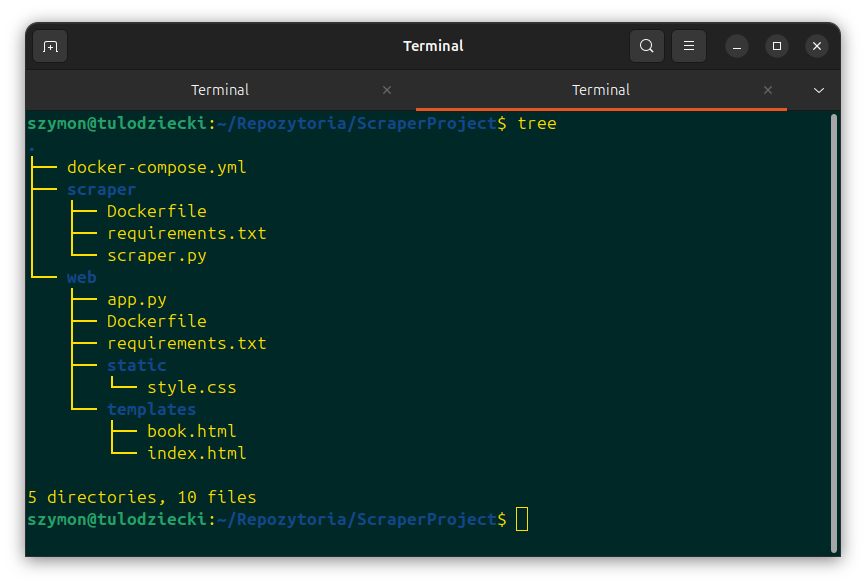
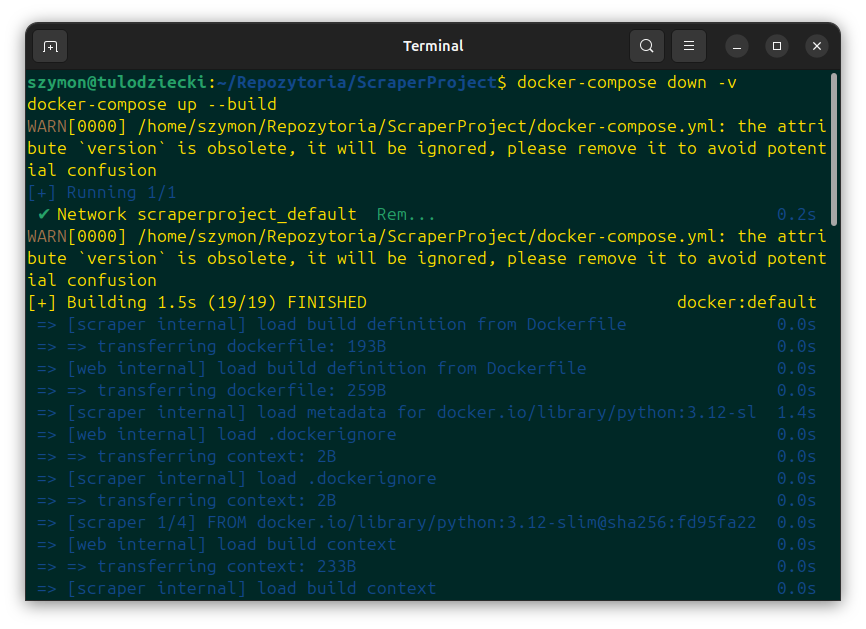
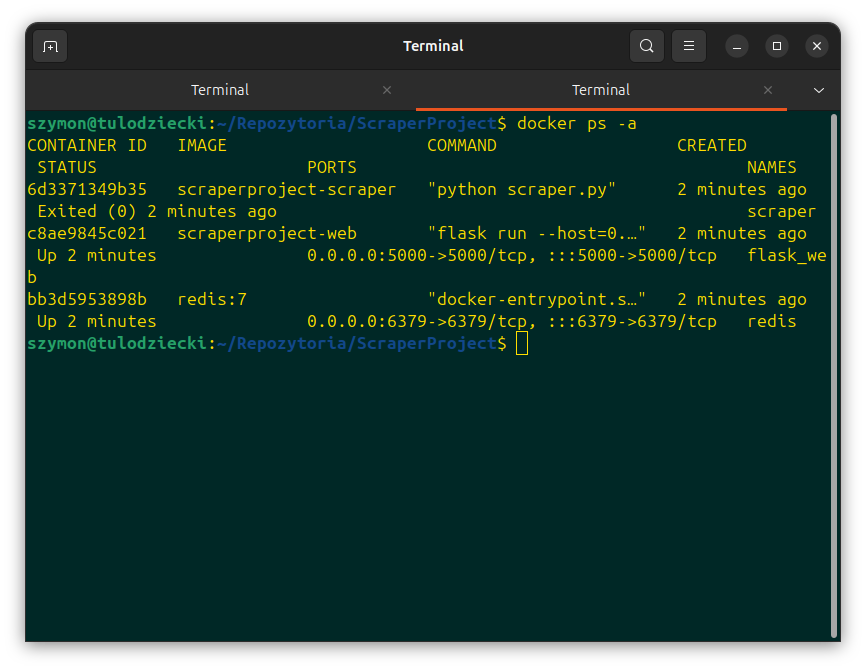
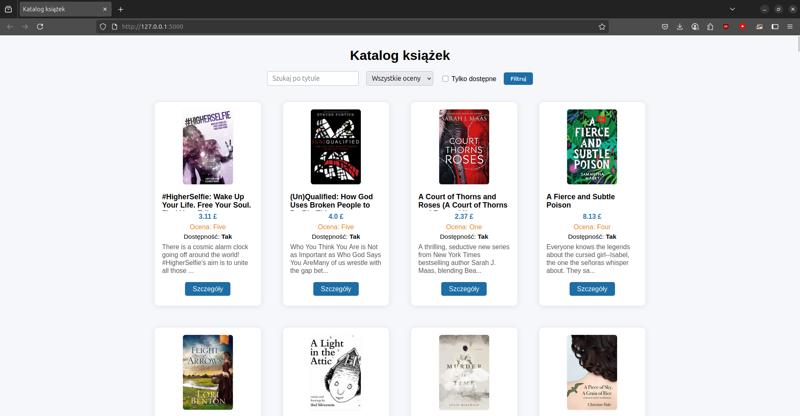
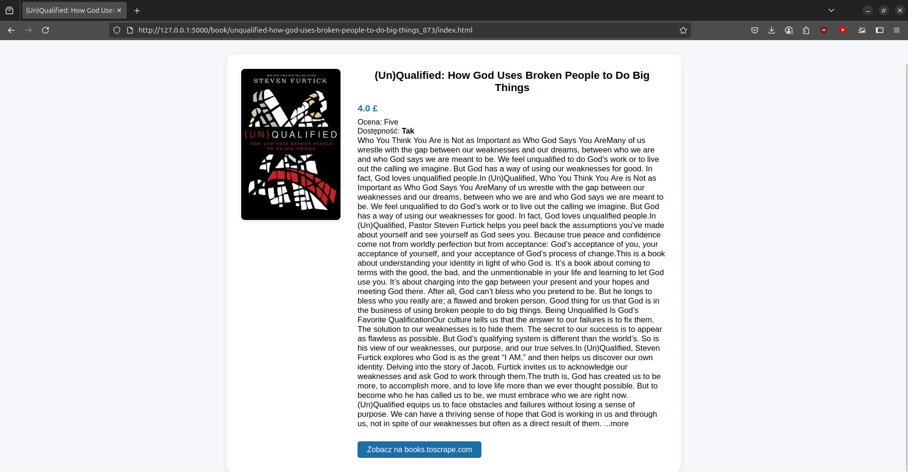

# Web Data Harvester

[](https://www.python.org/)
[](https://www.docker.com/)
[](https://docs.python.org/3/library/asyncio.html)
[](https://redis.io/)
[](https://flask.palletsprojects.com/)

---

Aplikacja do asynchronicznego scrapowania, selekcjonowania i prezentacji danych z witryn internetowych w architekturze rozproszonej. Projekt na kurs **Przetwarzanie równoległe i rozproszone** (2024/25).

---

## 🗂️ Opis projektu

Web Data Harvester to aplikacja, która pobiera, selekcjonuje i prezentuje dane (tytuł, cena, ocena, dostępność, opis, okładka) z serwisu [books.toscrape.com](https://books.toscrape.com/). System składa się z trzech kontenerów Docker: asynchronicznego scrapera, aplikacji webowej (Flask) oraz bazy danych Redis. Wszystkie komponenty są zarządzane przez `docker-compose`.

---

## 🛠️ Technologie

- **Python 3.12** – główny język programowania
- **asyncio, aiohttp** – asynchroniczne pobieranie danych
- **BeautifulSoup** – parsowanie HTML
- **Redis** – baza danych do przechowywania rekordów
- **Flask** – aplikacja webowa (interfejs użytkownika)
- **Docker** – konteneryzacja i łatwe wdrażanie

---

## 📂 Struktura katalogów



---

## ⚡ Szybki start

1. **Wymagania:**  
   - Docker + Docker Compose

2. **Budowanie i uruchomienie:**
   ```bash
   docker-compose up --build
   ```


3. **Dostęp:**  
Aplikacja webowa: [http://localhost:5000](http://localhost:5000)

---

## 🧩 Główne pliki

- `scraper/scraper.py` – asynchroniczny scraper (pobieranie i zapis danych)
- `web/app.py` – aplikacja Flask (interfejs użytkownika)
- `web/templates/` – szablony HTML
- `web/static/style.css` – style interfejsu
- `docker-compose.yml` – konfiguracja usług
- `scraper/Dockerfile`, `web/Dockerfile` – pliki budujące kontenery

---

## 🖼️ Zrzuty ekranu

### Budowanie kontenerów



### Interfejs aplikacji



---

## 📝 Wnioski techniczne

Aplikacja została zrealizowana jako system rozproszony, podzielony na trzy kontenery: scraper, aplikację webową (Flask) oraz bazę danych Redis, zarządzane przez `docker-compose`. Scraper wykorzystuje asynchroniczność (asyncio, aiohttp) oraz BeautifulSoup do wydajnego pobierania i przetwarzania danych, które są następnie zapisywane w Redis. Profil danych obejmuje wiele grup informacji, spełniając wymagania projektowe. Interfejs webowy umożliwia wygodne przeglądanie i filtrowanie danych. Całość jest łatwa do wdrożenia i skalowania dzięki konteneryzacji. Projekt spełnia wszystkie założenia techniczne i jest gotowy do dalszego rozwoju.
